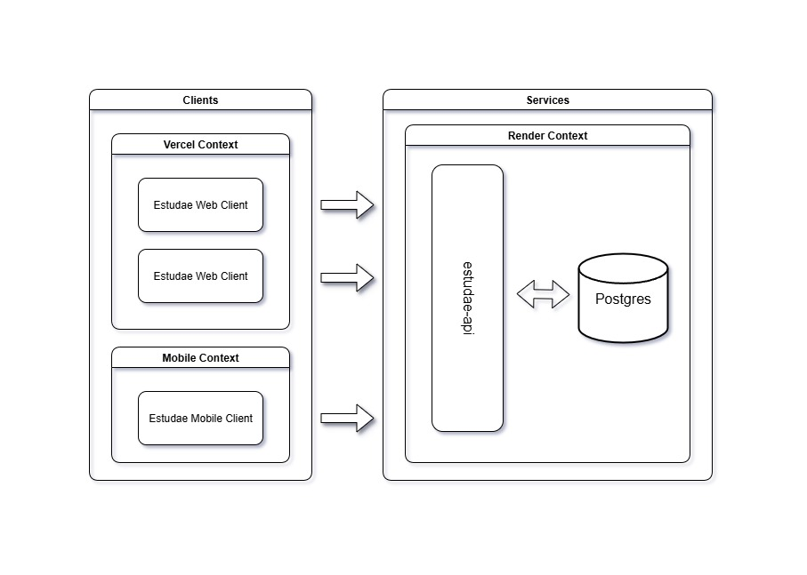

# Arquitetura

## Modelo e diagrama

O modelo de arquitetura escolhido foi o monolítico, pois não há necessidade de ser implementado algum outro modelo. Caso haja a necessidade de escalar o sistema ou houver alguma adição de componente, o esquema abaixo sofrerá modificações.

Modelo geral de arquitetura do projeto:

## Decisões técnicas

### Front-end

Dentre as opções disponíveis, foi optado pelo ReactJS com TS + Vite pois ele oferece um início de desenvolvimento muito rápido e todos no grupo já mexeram com a ferramenta, tornando ela melhor opção para o desenvolvimento;

### Back-end

Escolhemos o framework NestJS para desenvolver a parte de back-end pois torna o desenvolvimento mais seguro e convencional.

### Banco de dados

Foi escolhido o PostgreSQL pela confiabilidade de segurança do dados, pelo desempenho para caso de escalabilidade de usuários e pelo controle de concorrência que o banco suporta.

### Autenticação

O uso do Bcrypt resolve um problema que seria o rápido acesso do usuário. Inicialmente não tem motivos fortes para a implementação de dois fatores, então a implementação do Bcrypt resolve o problema.
